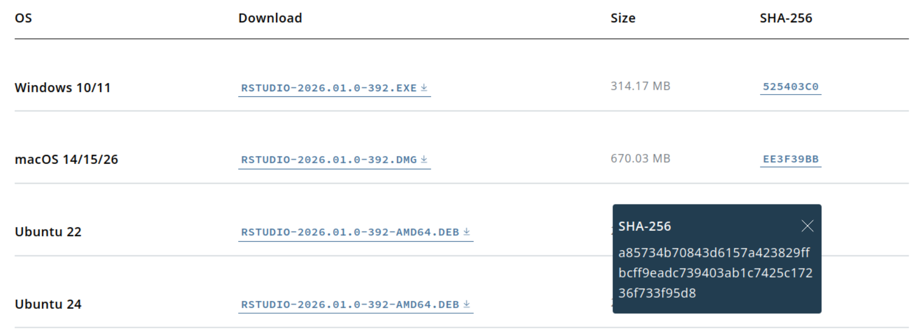

## Yet another tutorial on how to use a file checksum

What is a check sum and why do we need one? Let's assume you are downloading a file containing software from a website you trust, for instance you want to install the latest RStudio IDE to develop R code in your computer. In this case, the website provides a hash value to verify the authenticity of the file you are about to download.



You want to verify that the file you downloaded arrived unaltered to your computer after going throught he public Internet. The file hash generated with the SHA-256 algorithm provides a means to doing precisely this.

## What is a file hash?

This is an alternative to doing a full encryption of the file in order to verify that its contents have not been modified. A hashing algorithm turns the bytes of the file into a unique text string. This conversion is irreversible and this makes it different from file encryption.

The main application of a file hash is to distribute it along with the file itself. This assumes that the website information is genuine. However if the file is tampered with along the distribution channel, even by a single byte, the user would obtain a different hash value after applying the same hash algorithm on the altered file.

This help secure a file while it is in transit from a website to a destination client. Other use cases for file hashing are file duplicate detection, file tracking, and in file content change detection as in version control systems.

## How to generate the SHA-256 file hash in Ubuntu 24?

The SHA-256 algorithm is part of the SHA-2 family, designed by the American National Security Agency (NSA) and published by the [National Institute of Standards and Technology](https://en.wikipedia.org/wiki/National_Institute_of_Standards_and_Technology "National Institute of Standards and Technology") (NIST) as a [U.S.](https://en.wikipedia.org/wiki/United_States_of_America "United States of America") [Federal Information Processing Standard](https://en.wikipedia.org/wiki/Federal_Information_Processing_Standard "Federal Information Processing Standard") (FIPS), @sha-2-functions. It maps any input to a 256-bit

First of all download the file and the hash value. Then generate a target check file with the published original hash value and the path to the file that was downloaded on your local machine. Finally run the command `sha256sum --check` on the name of the check file. `sha256sum` will parse the original hash and will compare it to the one generated from the downloaded file. If they are the same then you will get an `OK` at the prompt, otherwise there will be a message about potential file corruption.

In short, here are the commands:

1.  Download the file using `wget`: `wget https://download1.rstudio.org/electron/jammy/amd64/rstudio-2026.01.0-392-amd64.deb ~/Downloads/rstudio-2026.01.0-392-amd64.deb` or using `curl`: `curl -L -o ~/Downloads/rstudio-2026.01.0-392-amd64.deb https://download1.rstudio.org/electron/jammy/amd64/rstudio-2026.01.0-392-amd64.deb`
2.  Generate the target check file with the published hash: `echo a85734b70843d6157a423829ffbcff9eadc739403ab1c7425c17236f733f95d8 ~/Downloads/rstudio-2026.01.0-392-amd64.deb > /tmp/sha256-target-check`
3.  Use `sha256sum` to compare the original hash and the one generated from the downloaded file: `sha256sum --check /tmp/sha256-target-check`

If the two hashes are identical you will see:

```         
/home/pablo/Downloads/rstudio-2026.01.0-392-amd64.deb: OK
```

To show the message you would get if a single byte is changed, let's fabricate a tampered file from a copy of the downloaded one. To simulate the alteration let's write `00` at position 1000 in the binary file using the combination of `print` and `dd` at the command line:

```         
$ cp ~/Downloads/rstudio-2026.01.0-392-amd64.deb ~/Downloads/rstudio-2026.01.0-392-amd64-tampered.deb
$ cd ~/Downloads
$ printf '\x00' | dd of=~/Downloads/rstudio-2026.01.0-392-amd64-tampered.deb bs=1 seek=1000 count=1 conv=notrunc
1+0 records in
1+0 records out
1 byte copied, 3.4209e-05 s, 29.2 kB/s
```

Now prepare the target check based on the simulated altered file:

```         
`echo a85734b70843d6157a423829ffbcff9eadc739403ab1c7425c17236f733f95d8 ~/Downloads/rstudio-2026.01.0-392-amd64-tampered.deb > /tmp/sha256-tampering-test`
```

Then the message is:

```         
sha256sum --check /tmp/sha256-tampering-test
/home/pablo/Downloads/rstudio-2026.01.0-392-amd64-tampered.deb: FAILED
sha256sum: WARNING: 1 computed checksum did NOT match
```

Note what happens if a mistake is made copying the original hash into the target check file. In the example below the last digit, 8, was replaced with a 1:

```         
echo a85734b70843d6157a423829ffbcff9eadc739403ab1c7425c17236f733f95d1 ~/Downloads/rstudio-2026.01.0-392-amd64.deb > /tmp/sha256-target-hash-error-check`
```

Then `sha256sum` would also complain that a hash mismatch happened. This can lead to a false positive by signalling possible file tampering:

```         
sha256sum --check /tmp/sha256-target-hash-error-check
/home/pablo/Downloads/rstudio-2026.01.0-392-amd64.deb: FAILED
sha256sum: WARNING: 1 computed checksum did NOT match
```

If the length of the hash is changed by mistake the error is different:

```         
echo a85734b70843d6157a423829ffbcff9eadc739403ab1c7425c17236f733f95d81 ~/Downloads/rstudio-2026.01.0-392-amd64.deb > /tmp/sha256-target-hash-too-long-check`
```

In this case the error is:

```         
sha256sum --check /tmp/sha256-target-hash-too-long-check
sha256sum: /tmp/sha256-target-hash-too-long-check: no properly formatted SHA256 checksum lines found
```

## Summary

There is a three-step process to use the published sha-256 file hash to verify the integrity of a file download. Download the file. Create a target check file with the published hash and the full-path name of the downloaded file. Then run the comparison with the program `sha256sum --check <target-check-file>`.

Some errors creating the target check file can mislead into thinking the downloaded file has been tampered with: a copy error in a single character of the original hash. Others are easily distinguishable from a real file hash mismatch, like accidentally shortening or lengthening the target hash by a single character.
