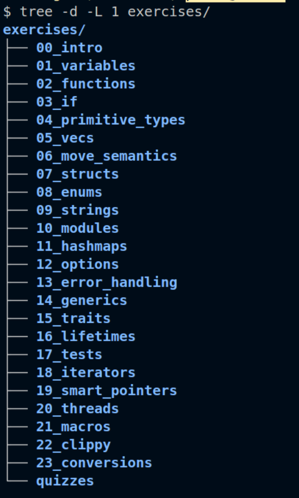
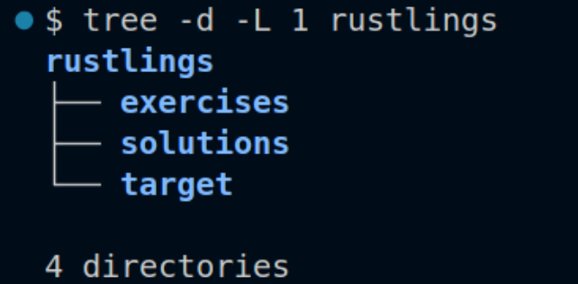
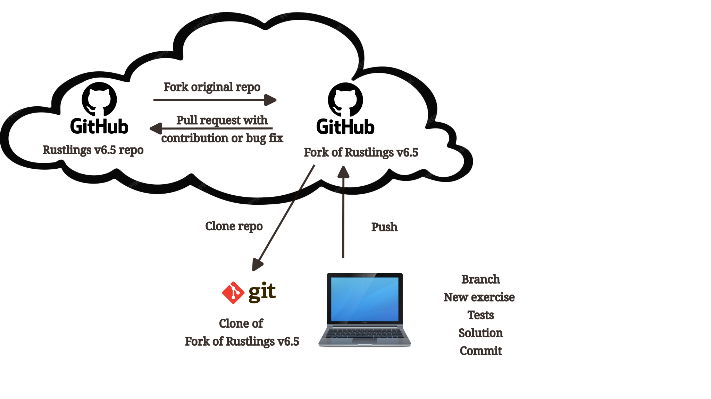

# What is Rustlings?

[Rust](https://www.rust-lang.org/) has killer apps for systems programming, web servers, command-line tools, blockchain tools, game engines, networking and web assembly. However, a less spoken killer app of sorts is its welcoming and friendly community.

This community creates and maintains resources for all newcomers through the free online book [The Rust Book](https://doc.rust-lang.org/stable/book/) and the accompanying set of exercises called [Rustlings](https://rustlings.rust-lang.org/).

Rustlings exercises take you on a whirlwind tour through Rust land. It starts with the humble flats of variable declaration and drives you through the ambitious hills of multithreading syntax for fearless concurrency. It makes stops along the way on the valleys of traits and structs for complex data modelling, the streams of error definition to avoid exceptional behaviour from bumping the regular flow of execution when returning from functions, and the forests of iterators and smart pointers, where the canopy of simple ergonomic patterns allows you to get the job done in safety.

{width="35%"}

# What does Rustlings do?

It is an interactive exercise framework.
You work through the exercises at your own pace and you can follow them as they appear one after the other in a prescribed order or choose which one to go to next from the list of unresolved challenges. 
The framework keeps track of the exercises that have been solved successfully so you are always aware of your progress. 
There are references to the section of the book touched on by code you are working on.

Rustlings exercises come in several forms.
Some have unit tests and a missing implementation. 
Others may just have a main function plus data structures, and incomplete or missing statements. 
Once the missing parts are filled in, the compiler terminates without errors and the tests pass successfully, one can choose what to do next. Quitting the program is always an open option in the interactive terminal.

# Getting and installing Rustlings

This post came to be because I was surprised by an error when I followed the older method of installing Rustlings on the newer version of the code.
It used to be necessary to clone the GitHub repository, then build and run the Rustlings executable that tracks your solved exercises. 

I remember thinking at some point, that I had become one of many people with a fork of the project but no real intention of becoming a contributor.
I found it hard enough to work through the exercises, let alone creating new ones. 

# Crates to the rescue

Now there is no need to go through Github or using git to work on Rustlings at all now. 
The project made a package to be distributed through crates.io with version 6.
As such you can install it following the traditional recipe `cargo install rustlings`. 
After the installation you will have the following three folders in the rustlings directory:

{width="30%"}

Typing `rustlings init` at the shell while on the rustlings folder for the first time will complete the setup. To get information type `rustlings --help` and to get you started working type `rustlings,` that will get the interactive mode on. 
The actual coding part to solve the exercises is done on a second, separate terminal window.
In that other window or terminal you can use a text editor to open the file the interactive session points you to.
Any Interactive Development Environment, IDE, will do. 
VS Code is very popular these days, so you can start the interactive program on the terminal emulator window while using the regular editor windows to make the code changes on the exercise file. 
Ruslings tracks the changes you do on the text file and updates the status accordingly on the interactive window until the exercise successfully compiles and all tests pass.
The image below illustrates a VS Code session where this process is happening as described.

# Separation of concerns

My opinion is that this change removed distractions for learners.
Using a crate and solving small focused Rust challenges may be less intimidating and thus more effective.
The previous alternative was the same plus dealing with source control toolins and a big chuck of the standard software development cycle on top of it.

There are two main roles that determine which tool set you use with Rustlings: user and contributor.
As of version 6, this project asks that users install Rustling from a crate.
Only project contributors really need to go through Github any more.

One last caveat, if you execute the command `cargo install rustlings` on the top folder of a cloned fork of the Rustlings repo, and then try to initialize the program (only necessary before you run it the first time), you will see an error and won't be able to run it. 
Have a look at the image below.

[Result of forking the official Rustlings repo on GitHub, cloning it locally and then trying to initialize an installation of the crate.](Attempt_init_over_cloned_fork.png)

So, what is the role of the official Github repo now that a self-contained crate has replaced it? 
Read on for my analysis.

# Git and Github

When you install the Rustlings crate on your machine, your solutions will be stored in the file system in the folder `exercises`. 
You can compare your solution versus the exercise author's solution in the corresponding file of the same name under the folder `solutions`.
Now imagine you want to keep a backup of your work in the cloud as you go through the many chapters of the book.
This is a process that may take months for some people.
Also what if you wanted to transfer your files, at their current state between two of your computers, maybe between a desktop and a laptop?

For those use cases, your Github account is an ideal solution.
Avoid cloning or forking the official Rustlings repo. 
Simply start a new repo on the machine where you installed Rustlings and setup a remote repo on your GitHub account.
At that point you can clone your own repo to other machines, work from them and push to GitHub as a means of keeping everything in sync.

If, on the other side, you desire to contribute to the Rustlings project, then you need to follow the traditional GitHub fork, branch, and pull-request workflow.
This is a useful pattern for code review.
The usual contributions can be a new exercise or a legit bug fix to something that you have found not working correctly.
A new exercise may offer practice on a yet un-covered section of the book.

Even when you follow the GitHub workflow you will likely have to do all your work initially on a regular crate installation. 
When your new piece is complete, then you can add it to a branch of a downstream clone of the official fork in your GitHub account, to start a pull request from the branch of the forked repo.

# Conclusions

The Rustlings project has clearer tools for learners and for project contributors now.
Users install a crate while more advanced Rustaceans go through the Git and GitHub avenues. 

You don't have to fork or clone the official Rustlings repo on Github anymore if all you want is to learn Rust by practicing while you read the book. 
You may still use your GitHub account and plain git to backup your work and share your specific solutions with others if you choose to do so.

If you want to become a Rustlings project contributor then the traditional GitHub workflow for Open Source projects applies.
In that case it may be better to do your software development on a Rustlings installation and after the work is completed, follow the full GitHub workflow and wait for the pull request to be approved and merged into the official main branch. 
You will only get your changes as part of the official project after a new crate release.
